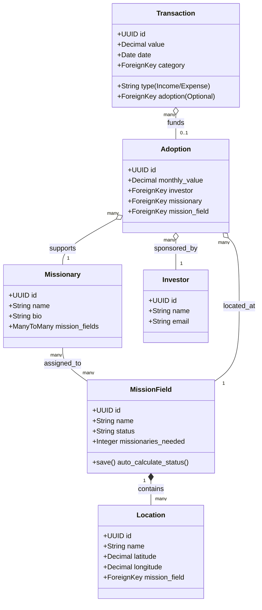

# AMAE — Agência Missionária de Apoio Estratégico

[](https://www.djangoproject.com/)
[](https://www.python.org/)
[](https://www.postgresql.org/)
[](https://htmx.org/)
[](https://tailwindcss.com/)
[](https://docs.pytest.org/)

A production-grade, server-side rendered (SSR) web application designed to connect financial sponsors (Investors) with missionaries in the field across Brazil. The platform automates financial adoptions, tracks mission-field locations via geocoded coordinates, handles transaction logging, and generates on-the-fly financial statements and receipt PDFs. 

Built using clean architecture principles, modern Django patterns, and a lightweight, high-performance frontend stack.

---

## 🏗️ Domain Architecture & Relationships

The business logic is organized into clean, isolated Django applications. The following entity-relationship model outlines how fields, locations, missionaries, investors, adoptions, and transactions interact:



### Decoupled Django Applications:
1. **`missions`**: Core domain logic governing `MissionField` status calculations, Google Maps location tracking, and adoptions.
2. **`finance`**: Administrative ledger handling income/expense `Transactions` and custom templates for financial statistics.
3. **`pages`**: CMS engine managing dynamic global text, dynamic FAQs, testimonials, and site image contexts.
4. **`accounts`**: User authorization, registration pipelines, and customized dashboard access.

---

## 🚀 Key Engineering & Design Highlights

### 1. High-Performance Asynchronous Frontend (SSR + HTMX 2)
To deliver a responsive, single-page application (SPA) user experience without the build complexity, large bundle sizes, and SEO penalties of heavy JS frameworks (like React or Vue):
- **HTMX 2 Integration**: Leverages HTMX attributes to trigger server-side fragment updates over AJAX. It updates the DOM inline, dramatically lowering time-to-interactive (TTI) and network usage.
- **Tailwind CSS v4 Compilation**: Configured with the modern `@tailwindcss/cli` compiler, reducing styling overhead and building CSS assets instantly via an isolated watcher service.

### 2. Transactional Stability & Business Logic Integrity
- **State Auto-Calculations**: `MissionField` status (e.g., active, partially adopted, fully staffed) is automatically re-computed within override `save()` hooks by aggregating live active adoptions against staffing requirements, ensuring database-level data consistency.
- **Dynamic PDF Rendering**: Uses `ReportLab` to programmatically build, cache, and render clean transaction receipts and corporate financial PDFs directly in memory (`BytesIO`), preventing disk bloat.

### 3. Comprehensive Testing Suite & Quality Gates
- **Parallelized Test Runner**: Leverages `pytest-xdist` to execute test suites concurrently across all CPU threads, reducing build integration check times in CI pipelines.
- **pytest-django Transaction Isolation**: Avoids persistent database pollution during testing by wrapping each unit test inside transactional database savepoints.
- **Strict Quality Control**: Enforces formatting standards and identifies logic anomalies before commits using `flake8`, `black` (88-char limit), and `isort` configurations.

---

## 💻 Local Setup & Quick Start

The project runs in a fully containerized environment separating the application server, asset watcher, and the database.

### Prerequisites
- Docker & Docker Compose v5+
- A Google Maps API Key (for field maps geolocation)

### Installation Steps

```bash
# 1. Clone the project and navigate to the directory
git clone <repository-url>
cd amae

# 2. Copy and configure local environment variables
cp .env.sample .env
# Populate SECRET_KEY, GOOGLE_MAPS_API_KEY, and database credentials inside .env

# 3. Spin up services in background (Web, Postgres DB, and Tailwind watcher)
docker compose up --build -d

# 4. Load initial database fixtures (Brazilian mission fields & dummy records)
docker compose exec web python manage.py seed
```

- **Web Portal Dashboard**: [http://localhost:8000](http://localhost:8000)
- **Django Admin Interface**: [http://localhost:8000/admin](http://localhost:8000/admin)

---

## 🧪 Verification & Verification Suites

### Running Automated Pytest Cases
Execute unit and integration tests inside the web container:
```bash
# Run tests in parallel
docker compose exec web pytest

# Run tests for a specific sub-app
docker compose exec web pytest missions/tests.py
```

### Static Analysis & Auto-Formatting
Keep code compliance consistent:
```bash
# Check code style issues (flake8, black, isort)
docker compose exec web make run-check-linters

# Auto-apply code formatters
docker compose exec web make run-fix-linters
```

---

## 🔒 Production Architecture Roadmap

For cloud deployments:
1. **WhiteNoise Static Delivery**: Static and compiled Tailwind assets are served securely directly by WSGI/ASGI servers through optimized caching headers via WhiteNoise.
2. **PostgreSQL 18 Optimization**: Relies on connection pooling (e.g., PgBouncer) and uses optimized Docker storage structures for high-read transaction logs.
3. **Locale & Timezone Alignment**: Configured natively with `pt-br` Portuguese locale and `America/Sao_Paulo` timezone configurations for accurate financial calendar calculations.

---

## 📄 License
MIT License. Refer to the license documentation for details.
